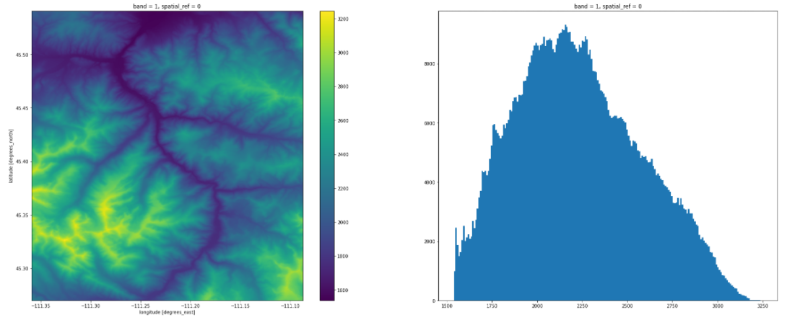
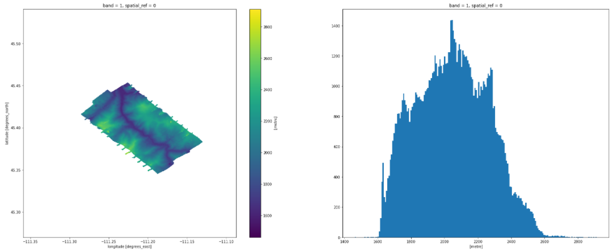
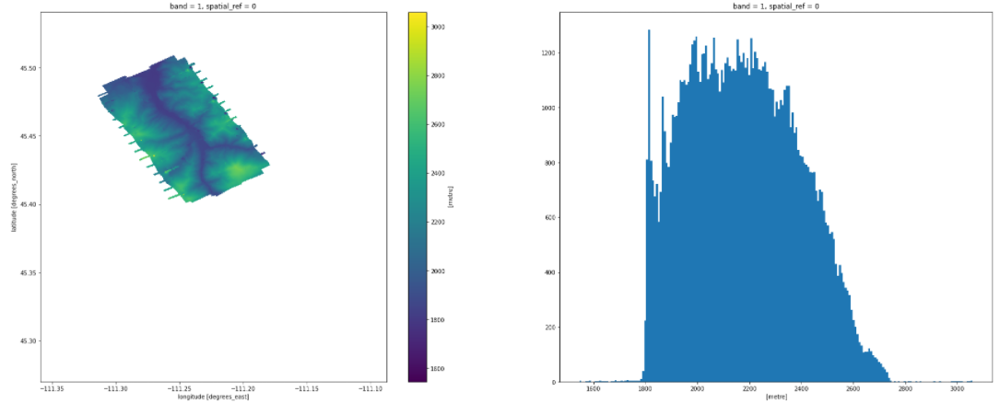
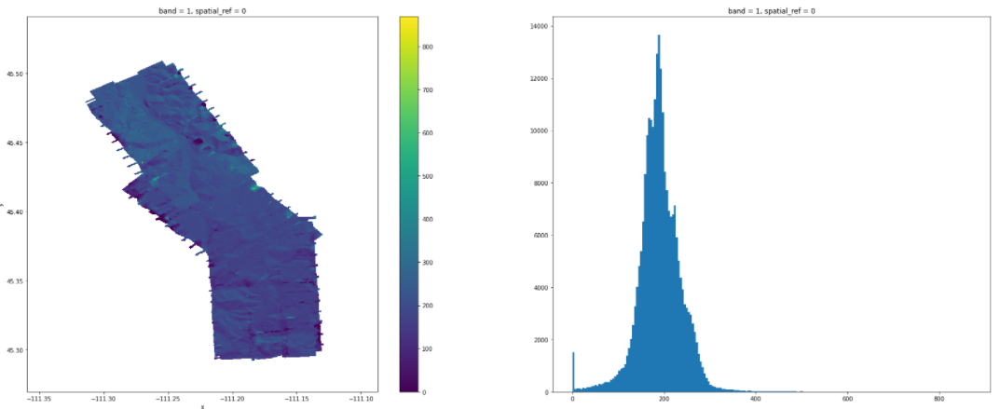

# canopy-height-model-generation
My submission for a coding interview where the goal was the generate a canopy height model from provided data.

I was allotted 4 hours to generate a CHM from the 3 provided DSMs and 1 DEM. I decided to use GDAL and Xarray.

# Provided
### DEM

### DSMs

# Final CHM

